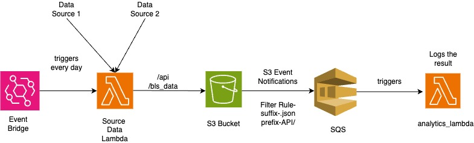

# Project README

This README provides instructions and information of solution, including data sources, source code, and infrastructure setup.

### Step 1 - Data Ingestion

- [population.json](https://mysources3bucket-rzox97pp.s3.amazonaws.com/api/population.json)
- [pr.footnote](https://mysources3bucket-rzox97pp.s3.amazonaws.com/bls_data/pr.footnote)
- [pr.measure](https://mysources3bucket-rzox97pp.s3.amazonaws.com/bls_data/pr.measure)
- [pr.period](https://mysources3bucket-rzox97pp.s3.amazonaws.com/bls_data/pr.period)
- [pr.seasonal](https://mysources3bucket-rzox97pp.s3.amazonaws.com/bls_data/pr.seasonal)
- [pr.sector](https://mysources3bucket-rzox97pp.s3.amazonaws.com/bls_data/pr.sector)
- [pr.class](https://mysources3bucket-rzox97pp.s3.amazonaws.com/bls_data/pr.class)
- [pr.contacts](https://mysources3bucket-rzox97pp.s3.amazonaws.com/bls_data/pr.contacts)
- [pr.data.0.Current](https://mysources3bucket-rzox97pp.s3.amazonaws.com/bls_data/pr.data.0.Current)
- [pr.data.1.AllData](https://mysources3bucket-rzox97pp.s3.amazonaws.com/bls_data/pr.data.1.AllData)
- [pr.duration](https://mysources3bucket-rzox97pp.s3.amazonaws.com/bls_data/pr.duration)
- [pr.series](https://mysources3bucket-rzox97pp.s3.amazonaws.com/bls_data/pr.series)
- [pr.txt](https://mysources3bucket-rzox97pp.s3.amazonaws.com/bls_data/pr.txt)

**Source Code:**

- Code for syncing data from S3 to your local environment is available in `/part_1_solution/src/fetch_data_source_1.py`.

### Step 2 - Data Fetching

**Source Code:**

- Code for fetching data is located in `/part_2_solution/src/fetch_population.py`.

### Step 3 - Data Analytics

**Source Code and Results:**

- Jupyter Notebook file containing source code and results is available in `/part_3_solution/src/part3.ipynb`.

### Step 4 - Data Pipeline Infrastructure

**Source Code for Infrastructure as Code:**

#### Running the AWS Terraform Infrastructure as Code

Follow these steps to set up and run the AWS Terraform IaC:

1. Clone the repository
 `[git clone](https://github.com/jyothh30/rearc_quest.git)`
2. Download and install Terraform, ensuring it is added to your system's PATH.
3. Open a terminal and navigate to your local directory.

1. Run `terraform init` to initialize the Terraform configuration.
2. Use `terraform plan` to preview the changes that will be applied.
3. Execute `terraform apply -auto-approve` to automatically approve and apply the changes, running the IaC to create the infrastructure.

configure the aws profile using aws configure --profile test and mention it in providers.tf 

# Architecture Diagram

